<div align="center">

```
> whoami
```


</div>

```diff
+ SELF-TAUGHT   C, C++, JAVA, PYTHON, HTML/CSS
+ ENGINE        Unreal Engine 5
+ 3D            Blender
+ SHIP          Cloudflare Workers, full-stack side projects
+ CURRENT FOCUS Deepening C++ specifically for game development
+ END GOAL      Founding my own game studio
```

<div align="center">

[](https://mohak-mittal.github.io/Portfolio)
[]()

</div>

<br/>

## `$ ./run gravity_drift.exe`

Not a Snake clone, not a to-do-list dressed up as a "game." **Gravity Drift** — you pilot a drone through rotating gravity wells, slingshotting around them for energy cores. One wrong angle and the well eats you.

The preview below is a **live, self-running simulation** — not a screenshot, not a video file. It's pure SVG + SMIL animation tracing actual orbital paths, looping forever, right here in this README:

<div align="center">



</div>

<sub>↑ that's rendering live in your browser right now, no JS, no video, no external service. The full playable build (mouse-controlled, escalating difficulty, persistent high score) is source-embedded below — copy it into an `.html` file and it runs instantly, or drop it on GitHub Pages for a link.</sub>

<details>
<summary><code>$ cat gravity-drift/index.html</code> — expand full source (single file, zero dependencies)</summary>

```html
<!DOCTYPE html>
<html lang="en">
<head>
<meta charset="UTF-8">
<title>GRAVITY DRIFT — by Mohak Mittal</title>
<meta name="viewport" content="width=device-width, initial-scale=1">
<style>
  :root{
    --void:#050510;
    --core:#00f0ff;
    --core2:#ff3df0;
    --warn:#ffcc33;
    --panel:#0b0b1e;
  }
  *{box-sizing:border-box; margin:0; padding:0;}
  html,body{
    height:100%;
    background:var(--void);
    overflow:hidden;
    font-family:'Segoe UI', system-ui, sans-serif;
    color:#e6f7ff;
  }
  #wrap{
    position:relative;
    width:100vw;
    height:100vh;
    display:flex;
    align-items:center;
    justify-content:center;
  }
  canvas{
    display:block;
    background:radial-gradient(ellipse at 50% 40%, #0d0d24 0%, #050510 70%);
    box-shadow:0 0 60px rgba(0,240,255,0.08) inset;
  }
  #hud{
    position:absolute;
    top:16px; left:16px;
    font-size:13px;
    letter-spacing:1px;
    line-height:1.6;
    text-shadow:0 0 8px rgba(0,240,255,0.6);
    pointer-events:none;
    user-select:none;
  }
  #hud .label{ color:#5fd4e8; opacity:0.8; }
  #hud .val{ color:#fff; font-weight:600; }
  #overlay{
    position:absolute; inset:0;
    display:flex; flex-direction:column;
    align-items:center; justify-content:center;
    text-align:center;
    background:rgba(3,3,12,0.82);
    backdrop-filter:blur(2px);
    padding:24px;
  }
  #overlay h1{
    font-size:clamp(28px,6vw,52px);
    letter-spacing:6px;
    background:linear-gradient(90deg,var(--core),var(--core2));
    -webkit-background-clip:text;
    background-clip:text;
    color:transparent;
    text-shadow:0 0 30px rgba(0,240,255,0.25);
    margin-bottom:10px;
  }
  #overlay p{ max-width:440px; color:#a9c7d8; font-size:14px; line-height:1.6; margin-bottom:18px; }
  #overlay .big{ font-size:15px; color:#fff; margin-bottom:6px; }
  #overlay .score{ font-size:40px; font-weight:700; color:var(--warn); text-shadow:0 0 20px rgba(255,204,51,0.4); margin-bottom:18px; }
  button{
    font-family:inherit;
    font-size:15px;
    letter-spacing:2px;
    padding:12px 30px;
    background:linear-gradient(90deg,var(--core),var(--core2));
    border:none;
    color:#03030a;
    font-weight:700;
    border-radius:2px;
    cursor:pointer;
    box-shadow:0 0 24px rgba(0,240,255,0.35);
    transition:transform .12s ease, box-shadow .12s ease;
  }
  button:hover{ transform:translateY(-2px); box-shadow:0 0 34px rgba(0,240,255,0.55); }
  button:active{ transform:translateY(0); }
  #footer{
    position:absolute; bottom:10px; width:100%;
    text-align:center; font-size:11px; letter-spacing:1px;
    color:#3d5a66; user-select:none;
  }
  #footer a{ color:#5fd4e8; text-decoration:none; }
  .hidden{ display:none !important; }
</style>
</head>
<body>
<div id="wrap">
  <canvas id="c" width="900" height="600"></canvas>

  <div id="hud">
    <div><span class="label">CORES </span><span class="val" id="hCores">0</span></div>
    <div><span class="label">TIME </span><span class="val" id="hTime">0.0s</span></div>
    <div><span class="label">BEST </span><span class="val" id="hBest">0</span></div>
  </div>

  <div id="overlay">
    <h1>GRAVITY DRIFT</h1>
    <p>
      Pilot the drone through a field of rotating gravity wells.
      Slingshot around them to collect energy cores — but drift too close
      and the pull will crush you. No fixed path. No safe loop. Just physics.
    </p>
    <div class="big">MOUSE / TOUCH to steer &nbsp;•&nbsp; hold to boost thrust</div>
    <button id="startBtn">LAUNCH</button>
  </div>

  <div id="deathOverlay" class="hidden" style="position:absolute;inset:0;display:flex;flex-direction:column;align-items:center;justify-content:center;background:rgba(3,3,12,0.88);text-align:center;">
    <div style="font-size:13px;letter-spacing:4px;color:#ff3df0;margin-bottom:6px;">SIGNAL LOST</div>
    <div class="score" id="finalScore">0</div>
    <div style="font-size:13px;color:#a9c7d8;margin-bottom:20px;" id="newBestMsg"></div>
    <button id="retryBtn">RE-LAUNCH</button>
  </div>

  <div id="footer">GRAVITY DRIFT — an original game by <a href="https://github.com/Mohak-Mittal" target="_blank">Mohak Mittal</a></div>
</div>

<script>
(() => {
  const canvas = document.getElementById('c');
  const ctx = canvas.getContext('2d');
  const W = canvas.width, H = canvas.height;

  const overlay = document.getElementById('overlay');
  const deathOverlay = document.getElementById('deathOverlay');
  const startBtn = document.getElementById('startBtn');
  const retryBtn = document.getElementById('retryBtn');
  const hCores = document.getElementById('hCores');
  const hTime = document.getElementById('hTime');
  const hBest = document.getElementById('hBest');
  const finalScore = document.getElementById('finalScore');
  const newBestMsg = document.getElementById('newBestMsg');

  let best = Number(localStorage.getItem('gravityDriftBest') || 0);
  hBest.textContent = best;

  let running = false;
  let mouse = { x: W/2, y: H/2, down: false };
  let ship, wells, cores, particles, startTime, cores_collected, animId;

  function resetGame() {
    ship = {
      x: W/2, y: H - 80,
      vx: 0, vy: 0,
      radius: 7,
      trail: []
    };
    wells = [];
    const wellCount = 3;
    for (let i = 0; i < wellCount; i++) {
      wells.push({
        x: 150 + Math.random() * (W - 300),
        y: 120 + Math.random() * (H - 300),
        mass: 1800 + Math.random() * 1200,
        radius: 18 + Math.random() * 10,
        hue: 180 + i * 45,
        orbitAngle: Math.random() * Math.PI * 2,
        orbitSpeed: (Math.random() - 0.5) * 0.006,
        orbitRadius: 0
      });
    }
    cores = [];
    spawnCore();
    particles = [];
    cores_collected = 0;
    startTime = performance.now();
  }

  function spawnCore() {
    let x, y, tooClose;
    do {
      x = 60 + Math.random() * (W - 120);
      y = 60 + Math.random() * (H - 120);
      tooClose = wells.some(w => Math.hypot(w.x - x, w.y - y) < w.radius + 60);
    } while (tooClose);
    cores.push({ x, y, radius: 8, pulse: Math.random() * Math.PI * 2 });
  }

  function addBurst(x, y, color, n = 18) {
    for (let i = 0; i < n; i++) {
      const a = Math.random() * Math.PI * 2;
      const s = 1 + Math.random() * 4;
      particles.push({
        x, y,
        vx: Math.cos(a) * s, vy: Math.sin(a) * s,
        life: 1, color
      });
    }
  }

  function update(dt) {
    const difficulty = 1 + cores_collected * 0.12;

    const dx = mouse.x - ship.x, dy = mouse.y - ship.y;
    const dist = Math.hypot(dx, dy) || 1;
    const thrust = mouse.down ? 0.55 : 0.28;
    ship.vx += (dx / dist) * thrust;
    ship.vy += (dy / dist) * thrust;

    for (const w of wells) {
      w.orbitAngle += w.orbitSpeed * difficulty * dt;
      w.x += Math.cos(w.orbitAngle) * 0.15 * difficulty;
      w.y += Math.sin(w.orbitAngle * 1.3) * 0.15 * difficulty;
      w.x = Math.max(60, Math.min(W - 60, w.x));
      w.y = Math.max(60, Math.min(H - 60, w.y));

      const wdx = w.x - ship.x, wdy = w.y - ship.y;
      const wdist = Math.hypot(wdx, wdy) || 1;
      const force = (w.mass * difficulty) / (wdist * wdist);
      ship.vx += (wdx / wdist) * force * dt * 0.06;
      ship.vy += (wdy / wdist) * force * dt * 0.06;

      if (wdist < w.radius + ship.radius) {
        return 'dead';
      }
    }

    ship.vx *= 0.985;
    ship.vy *= 0.985;

    ship.x += ship.vx * dt;
    ship.y += ship.vy * dt;

    if (ship.x < ship.radius) { ship.x = ship.radius; ship.vx *= -0.6; }
    if (ship.x > W - ship.radius) { ship.x = W - ship.radius; ship.vx *= -0.6; }
    if (ship.y < ship.radius) { ship.y = ship.radius; ship.vy *= -0.6; }
    if (ship.y > H - ship.radius) { ship.y = H - ship.radius; ship.vy *= -0.6; }

    ship.trail.push({ x: ship.x, y: ship.y });
    if (ship.trail.length > 26) ship.trail.shift();

    for (let i = cores.length - 1; i >= 0; i--) {
      const c = cores[i];
      c.pulse += 0.08 * dt;
      const cd = Math.hypot(c.x - ship.x, c.y - ship.y);
      if (cd < c.radius + ship.radius + 4) {
        addBurst(c.x, c.y, '255,204,51', 24);
        cores.splice(i, 1);
        cores_collected++;
        spawnCore();
        if (cores_collected % 4 === 0 && wells.length < 6) {
          wells.push({
            x: 150 + Math.random() * (W - 300),
            y: 120 + Math.random() * (H - 300),
            mass: 1800 + Math.random() * 800,
            radius: 16 + Math.random() * 8,
            hue: 180 + Math.random() * 180,
            orbitAngle: Math.random() * Math.PI * 2,
            orbitSpeed: (Math.random() - 0.5) * 0.006
          });
        }
      }
    }

    for (let i = particles.length - 1; i >= 0; i--) {
      const p = particles[i];
      p.x += p.vx; p.y += p.vy;
      p.vx *= 0.94; p.vy *= 0.94;
      p.life -= 0.02 * dt;
      if (p.life <= 0) particles.splice(i, 1);
    }

    return 'ok';
  }

  function draw() {
    ctx.clearRect(0, 0, W, H);

    ctx.fillStyle = 'rgba(255,255,255,0.4)';
    for (let i = 0; i < 60; i++) {
      const sx = (i * 137.5) % W;
      const sy = (i * 91.3 + 40) % H;
      ctx.globalAlpha = 0.15 + (Math.sin(performance.now()/900 + i) + 1) * 0.15;
      ctx.fillRect(sx, sy, 1.4, 1.4);
    }
    ctx.globalAlpha = 1;

    for (const w of wells) {
      const grd = ctx.createRadialGradient(w.x, w.y, 0, w.x, w.y, w.radius * 6);
      grd.addColorStop(0, `hsla(${w.hue}, 100%, 60%, 0.35)`);
      grd.addColorStop(1, 'transparent');
      ctx.fillStyle = grd;
      ctx.beginPath();
      ctx.arc(w.x, w.y, w.radius * 6, 0, Math.PI * 2);
      ctx.fill();

      ctx.beginPath();
      ctx.arc(w.x, w.y, w.radius, 0, Math.PI * 2);
      ctx.fillStyle = `hsl(${w.hue}, 90%, 55%)`;
      ctx.shadowColor = `hsl(${w.hue}, 100%, 60%)`;
      ctx.shadowBlur = 20;
      ctx.fill();
      ctx.shadowBlur = 0;
    }

    for (const c of cores) {
      const pulse = 1 + Math.sin(c.pulse) * 0.25;
      ctx.beginPath();
      ctx.arc(c.x, c.y, c.radius * pulse, 0, Math.PI * 2);
      ctx.fillStyle = '#ffcc33';
      ctx.shadowColor = '#ffcc33';
      ctx.shadowBlur = 18;
      ctx.fill();
      ctx.shadowBlur = 0;
    }

    for (const p of particles) {
      ctx.globalAlpha = Math.max(p.life, 0);
      ctx.fillStyle = `rgb(${p.color})`;
      ctx.beginPath();
      ctx.arc(p.x, p.y, 2.4, 0, Math.PI * 2);
      ctx.fill();
    }
    ctx.globalAlpha = 1;

    for (let i = 0; i < ship.trail.length; i++) {
      const t = ship.trail[i];
      ctx.globalAlpha = (i / ship.trail.length) * 0.5;
      ctx.fillStyle = '#00f0ff';
      ctx.beginPath();
      ctx.arc(t.x, t.y, 2.4, 0, Math.PI * 2);
      ctx.fill();
    }
    ctx.globalAlpha = 1;

    ctx.beginPath();
    ctx.arc(ship.x, ship.y, ship.radius, 0, Math.PI * 2);
    ctx.fillStyle = '#eafffe';
    ctx.shadowColor = '#00f0ff';
    ctx.shadowBlur = 16;
    ctx.fill();
    ctx.shadowBlur = 0;
  }

  let lastTime = performance.now();
  function loop(now) {
    if (!running) return;
    const dt = Math.min((now - lastTime) / 16.67, 2.2);
    lastTime = now;

    const state = update(dt);
    draw();

    hCores.textContent = cores_collected;
    hTime.textContent = ((now - startTime) / 1000).toFixed(1) + 's';

    if (state === 'dead') {
      endGame();
      return;
    }
    animId = requestAnimationFrame(loop);
  }

  function endGame() {
    running = false;
    addBurst(ship.x, ship.y, '255,61,240', 40);
    draw();
    const score = cores_collected * 100 + Math.floor((performance.now() - startTime) / 100);
    finalScore.textContent = score;
    if (score > best) {
      best = score;
      localStorage.setItem('gravityDriftBest', best);
      hBest.textContent = best;
      newBestMsg.textContent = '★ NEW BEST ★';
    } else {
      newBestMsg.textContent = '';
    }
    deathOverlay.classList.remove('hidden');
  }

  function startGame() {
    overlay.classList.add('hidden');
    deathOverlay.classList.add('hidden');
    resetGame();
    running = true;
    lastTime = performance.now();
    animId = requestAnimationFrame(loop);
  }

  canvas.addEventListener('mousemove', e => {
    const r = canvas.getBoundingClientRect();
    mouse.x = (e.clientX - r.left) * (W / r.width);
    mouse.y = (e.clientY - r.top) * (H / r.height);
  });
  canvas.addEventListener('mousedown', () => mouse.down = true);
  canvas.addEventListener('mouseup', () => mouse.down = false);
  canvas.addEventListener('touchmove', e => {
    e.preventDefault();
    const t = e.touches[0];
    const r = canvas.getBoundingClientRect();
    mouse.x = (t.clientX - r.left) * (W / r.width);
    mouse.y = (t.clientY - r.top) * (H / r.height);
    mouse.down = true;
  }, { passive: false });
  canvas.addEventListener('touchend', () => mouse.down = false);

  startBtn.addEventListener('click', startGame);
  retryBtn.addEventListener('click', startGame);
})();
</script>
</body>
</html>
```

</details>

<br/>

## `$ cat about.md`

```
root@mohak:~$ whoami --verbose

  base       : Barnala, Punjab, India
  education  : BCA · 6th semester · S.D. College Barnala (Punjabi University, Patiala)
  role       : Game Developer / 3D Artist — self-taught
  stack      : C, C++, Java, Python, HTML, CSS
  engine     : Unreal Engine 5
  3D suite   : Blender
  deploy     : Cloudflare Workers
  status     : deepening C++ for game dev, grinding toward a studio of my own
```

<br/>

## `$ ls ./projects/`

<table>
<tr><td>

**`void_rift/`**
Top-down roguelite shooter — six enemy AI types, full ability + XP system, ten escalating waves, WASD + mouse.
`JavaScript` `Canvas` `Game AI`

</td><td>

**`sl_rpg_tracker/`**
Solo Leveling-inspired productivity app. Real tasks become idle dungeon combat — canonical character roster, E-through-Monarch ranking.
`Three.js` `Vanilla JS`

</td></tr>
<tr><td>

**`fitforge/`**
AI fitness app — Groq-generated vegetarian meal plans, streak tracking, progressive difficulty, 20 achievements.
`Cloudflare Workers` `Groq API`

</td><td>

**`toolzone/`**
Free online tools platform, still growing. Percentage / discount / GST calculators live, modular per-tool architecture.
`JavaScript`

</td></tr>
<tr><td>

**`portfolio/ + aria/`**
Cyberpunk personal site with **ARIA** — a JARVIS-style full-screen HUD voice assistant, radar sweeps, Groq/Llama backend that actually knows my work.
`Cloudflare Workers` `Groq` `Web Speech API`

</td><td>

**`jarvis_pc/`**
Python voice assistant controlling my PC — `listener.py → brain.py → speaker.py → system.py`, custom file indexer.
`Python` `Automation`

</td></tr>
</table>

<br/>

## `$ curl stats.mohak`

<div align="center">


<br/>


</div>

<br/>

## `$ ping mohak --connect`

<div align="center">

[](https://mohak-mittal.github.io/Portfolio)
[](#)
[](#)
[](mailto:you@example.com)

</div>

<div align="center">
<sub>connection stable · last compiled: runtime · building a studio, one commit at a time_</sub>
</div>
