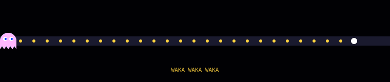
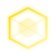
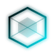

 

 

## 🛠️ Tools I Use

 

**Unreal Engine 5**
My primary engine — where the actual games get built.
  

**Blender**
All my 3D modeling, sculpting, and asset work happens here.
  

**C++**
The language I'm sharpening hardest right now, specifically for game dev.
  

**Python**
My go-to for automation, tooling, and quick backend logic.
  

**JavaScript**
For everything that needs to run in a browser.
  

**Three.js**
For 3D rendering directly on the web.
  

**Cloudflare Workers**
My deployment layer for full-stack side projects.
  

**Java**
Solid foundation from early self-taught learning.
  

 

 

## 🏆 Trophies

 

## 📊 GitHub Stats

 

 

## 📡 Connect

