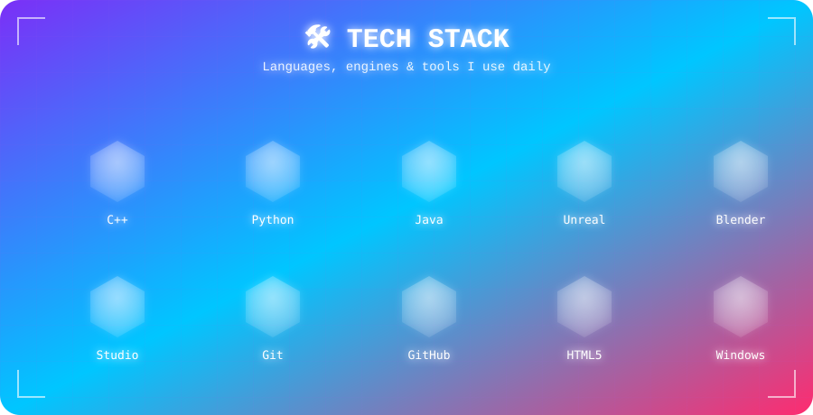

I build immersive 3D experiences and interactive applications. Passionate about **Game Development**, **Real-time Graphics**, and creating impactful projects.

📍 Barnala, Punjab, India &nbsp;|&nbsp; 🎓 BCA Graduate

 

## 👋 About Me

 

## 🛠️ Tech Stack

 

## 🌆 3D Contribution Graph

> Your real commit history, rendered as a little isometric city skyline — taller, brighter buildings mean more contributions that day. Auto-regenerated daily by the included GitHub Action (`.github/workflows/3d-contrib.yml`), same setup style as the snake.

 

## 🚀 Featured Projects

<table width="100%">
<tr>
<td width="50%" valign="top">

### 🩸 Horror_Game
**Unreal Engine 5 · Pure C++**

A Granny-style first-person horror game built from scratch in C++ — AI enemy with sight/hearing perception, patrol/investigate/chase states, physics-reactive props, torch battery system, and door/key mechanics.

`C++` `AI` `Game Design`

</td>
<td width="50%" valign="top">

### 💪 FitForge
**Web App**

Fitness tracker with a dark ASUS Armory Crate–inspired HUD: dual semi-circle progress rings for exercise & meals, scanline bars, and particle aura effects that escalate with streak tiers.

`JavaScript` `CSS` `Canvas`

</td>
</tr>
<tr>
<td width="50%" valign="top">

### 🤖 AI Companion App
**C++ · Local-first**

A local AI companion with a reactive VRM avatar, mic input via Web Speech API, an LLM brain with emotion tagging, TTS, and lip sync — all running on a local C++ backend.

`C++` `AI` `VRM`

</td>
<td width="50%" valign="top">

### 🌐 Portfolio Website
**HTML · CSS · JS**

Personal site hosted on GitHub Pages with a Cloudflare Worker backend, featuring ARIA — a voice-enabled AI chatbot built with Transformers.js.

`HTML` `CSS` `JavaScript`

</td>
</tr>
</table>

**[→ See all repos](https://github.com/mohak-mittal?tab=repositories)**

 

## 📊 GitHub Stats

 

 

## 🏆 Trophies

 

## 🐍 Contribution Snake

<picture>
  <source media="(prefers-color-scheme: dark)" srcset="https://raw.githubusercontent.com/mohak-mittal/mohak-mittal/output/github-contribution-grid-snake-dark.svg" />
  <source media="(prefers-color-scheme: light)" srcset="https://raw.githubusercontent.com/mohak-mittal/mohak-mittal/output/github-contribution-grid-snake.svg" />
  
</picture>

> A neon-purple snake that eats through your real contribution graph — regenerated daily by the included GitHub Action. Its length is tied to your actual 52-week contribution history (that part's controlled by GitHub, not by us), but the deep-violet-to-neon-magenta gradient is fully custom.

 

## 💭 What I Believe

> Code isn't just about syntax — it's about solving real problems and building something people actually love using.

 

## 📫 Let's Connect

I'm always open to collaboration, freelance work, or just talking shop about game dev and C++.

<i>Thanks for visiting! ⭐</i>

