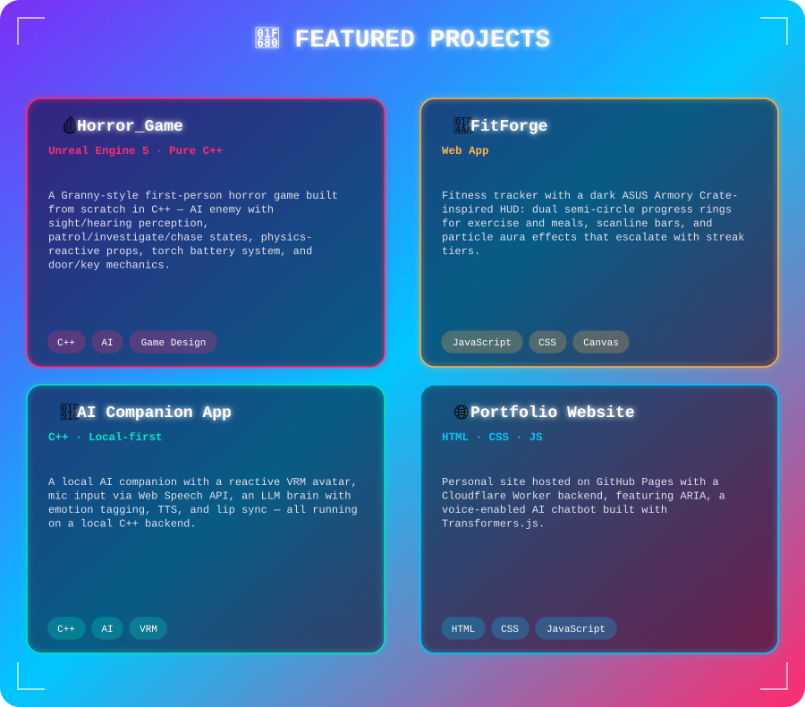
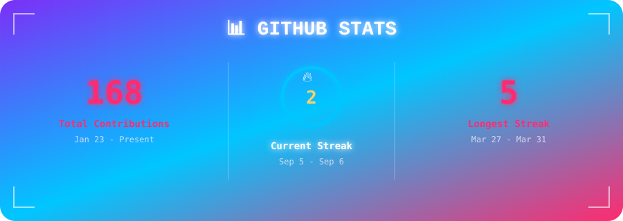
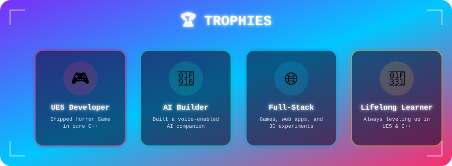
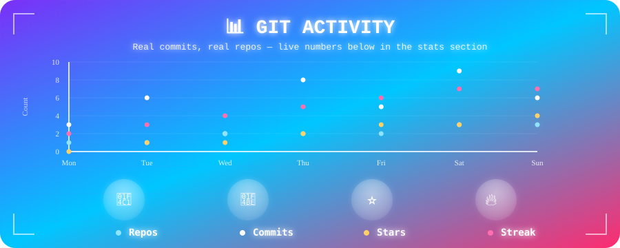

I build immersive 3D experiences and interactive applications. Passionate about **Game Development**, **Real-time Graphics**, and creating impactful projects.

📍 Barnala, Punjab, India &nbsp;|&nbsp; 🎓 BCA Graduate

 

## 👋 About Me

 

## 🛠️ Tech Stack

 

## 🚀 Featured Projects

**[→ See all repos](https://github.com/mohak-mittal?tab=repositories)**

 

## 📊 GitHub Stats

 

## 🏆 Trophies

 

## 🐍 Contribution Snake & 3D Graph

<picture>
  <source media="(prefers-color-scheme: dark)" srcset="https://raw.githubusercontent.com/mohak-mittal/mohak-mittal/output/github-contribution-grid-snake-dark.svg" />
  <source media="(prefers-color-scheme: light)" srcset="https://raw.githubusercontent.com/mohak-mittal/mohak-mittal/output/github-contribution-grid-snake.svg" />
  
</picture>

  

  

> Both driven by your real commit history, regenerated daily by their own GitHub Actions, and both recolored to the same deep-violet → neon-magenta palette as the rest of the profile. The snake's length is tied to your actual 52-week contribution history (GitHub controls that part, not us) — the 3D graph turns that same data into a little isometric city skyline where taller, brighter buildings mean more contributions that day.

 

## 💭 What I Believe

> Code isn't just about syntax — it's about solving real problems and building something people actually love using.

 

## 📫 Let's Connect

I'm always open to collaboration, freelance work, or just talking shop about game dev and C++.

<i>Thanks for visiting! ⭐</i>

